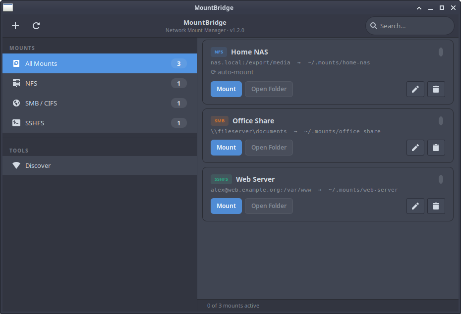

# MountBridge

> A network mount manager for **XFCE / Debian** — NFS, SMB/CIFS and SSHFS with system keyring credential storage, live mount discovery and a clean native GTK3 UI.




---

## Features

| Feature | Detail |
|---|---|
| **Mount types** | NFS, SMB/CIFS, SSHFS |
| **Credentials** | Stored in the system keyring (gnome-keyring / KWallet via SecretService — never written to disk in plaintext) |
| **Live mount detection** | Watches the kernel mount table (`/proc/self/mountinfo`) and updates instantly — unmanaged NFS/SMB/SSHFS mounts appear automatically with an **Import** button. Never stats a mountpoint, so a hung server can't freeze the UI |
| **Network discovery** | SMB broadcast via Avahi mDNS · SMB share listing via `smbclient` · NFS export listing via `showmount` |
| **Auto-mount** | Per-mount toggle; runs when MountBridge starts, waiting for the network if needed |
| **XFCE native** | Uses xfwm4 server-side decorations (no GTK CSD) — title bar, min/max/close behave normally |
| **System tray** | Ayatana AppIndicator3 with Open/Quit menu; falls back to `Gtk.StatusIcon`. Closing the window keeps MountBridge running in the tray |
| **Notifications** | libnotify desktop notification on mount/unmount success or failure |
| **Keyboard shortcuts** | Ctrl+N — add a mount · Ctrl+Q — quit |
| **Least privilege** | NFS/SMB go through a small validating root helper; SSHFS never uses root |

---

## Requirements

### Debian / Ubuntu packages

```bash
sudo apt install \
    python3-gi python3-gi-cairo gir1.2-gtk-3.0 \
    gir1.2-notify-0.7 \
    python3-keyring python3-secretstorage \
    sshfs cifs-utils nfs-common \
    avahi-utils smbclient pipx \
    gnome-keyring
```

### Optional (system tray icon)

```bash
# Prefer Ayatana (modern):
sudo apt install gir1.2-ayatanaappindicator3-0.1
# Or legacy:
sudo apt install gir1.2-appindicator3-0.1
```

---

## Installation

### Debian package (recommended)

One `.deb` works on **Debian 12, 13 and testing**, **Ubuntu 22.04 and 24.04**,
and distributions based on them (Linux Mint, Pop!_OS, …). Download
`mountbridge_<version>_all.deb` from the
[Releases](https://github.com/mpx14/mountbridge/releases) page, then:

```bash
sudo apt install ./mountbridge_1.2.0_all.deb
```

`apt` pulls in all dependencies. The package installs the app, the NFS/SMB root
helper and a sudoers rule for the `mountbridge` group, and asks whether **you**
(the user running `sudo apt install`) should get NFS/SMB access. Answer yes, then
log out and back in once. SSHFS works for everyone without any of this.

Other ways to grant NFS/SMB access — for other users on a shared machine, or if
you answered no:

- **In MountBridge:** mounting an NFS/SMB share without access offers
  **Grant Access…**, which asks for an administrator's password.
- `sudo dpkg-reconfigure mountbridge` asks the question again for you.
- `sudo adduser <user> mountbridge` for any user.

Each takes effect at that user's next login. Unattended installs
(`DEBIAN_FRONTEND=noninteractive`) never add anyone.

**Switching from `install.sh` to the package:**

```bash
pipx uninstall mountbridge            # or ~/.local/bin/mountbridge shadows /usr/bin/mountbridge
rm -f ~/.local/share/applications/mountbridge.desktop \
      ~/.local/share/icons/hicolor/scalable/apps/mountbridge.svg
sudo rm -f /usr/local/libexec/mountbridge-helper
sed -i 's|^Exec=.*|Exec=mountbridge --hidden|' ~/.config/autostart/mountbridge.desktop  # if you use autostart
sudo apt install ./mountbridge_1.2.0_all.deb
```

The package replaces the sudoers rule written by `install.sh` (or by 1.1)
automatically, without a configuration-file prompt.

### Build the package yourself

```bash
git clone https://github.com/mpx14/mountbridge.git
cd mountbridge
sudo apt-get build-dep ./      # debhelper, dh-python, pybuild-plugin-pyproject, …
make deb                       # → dist/mountbridge_<version>_all.deb
```

Build on the **oldest** release you want to support (the CI builds on Debian 12);
the result installs on newer ones.

### From source (`install.sh`)

For distributions without a package, or to run the latest `main`:

```bash
git clone https://github.com/mpx14/mountbridge.git
cd mountbridge
bash install.sh
```

The installer will:

1. Install the `apt` dependencies
2. Install the `mountbridge` Python package with `pipx` (its venv can see apt's `python3-gi`)
3. Create `~/.mounts/` and `~/.config/mountbridge/`
4. Install the `.desktop` entry and SVG icon
5. Optionally create an autostart entry (starts minimised to the tray)
6. Optionally install the NFS/SMB root helper and sudoers rule, create the
   `mountbridge` group and add you to it (and replace the unsafe rule from 1.1)

---

## NFS / SMB and root

SSHFS is fully userspace — no root is ever involved. Mounting NFS and SMB/CIFS
requires root, so MountBridge uses a small root helper and a sudoers rule that
lets members of the `mountbridge` group run **only that helper**:

```
%mountbridge ALL=(root) NOPASSWD: /usr/libexec/mountbridge/mountbridge-helper
```

(With `install.sh` the helper lives at `/usr/local/libexec/mountbridge-helper`
instead.) Grant a user access with `sudo adduser <user> mountbridge`; it takes
effect at their next login. MountBridge tells users who aren't in the group yet
exactly what to ask their administrator.

The helper is the security boundary. It:

- mounts only `nfs`, `nfs4` and `cifs`, only at `/mnt/mountbridge/<user>/<name>`
  (a root-owned tree the user can't tamper with);
- accepts only allow-listed mount options, and always adds `nosuid,nodev`;
- forces `uid`/`gid` on CIFS mounts to the calling user;
- reads SMB credentials from stdin and never from the command line;
- unmounts only nfs/cifs mounts in the caller's own directory.

`~/.mounts/<name>` is created as a shortcut (symlink) to the real mountpoint.

> **Upgrading from 1.1:** the old rule granted `mount`/`umount` with wildcard
> arguments, which is equivalent to full root (for example `mount --bind` over
> `/etc`). Both the package and `install.sh` detect and replace it. If you're
> not upgrading right away, remove it now: `sudo rm /etc/sudoers.d/mountbridge`.

---

## Keyring setup (XFCE)

MountBridge uses the SecretService API. On a fresh XFCE install:

1. `sudo apt install gnome-keyring`
2. **Session and Startup → Application Autostart** → Add:
   - Command: `/usr/bin/gnome-keyring-daemon --start`
3. Log out and back in

---

## Configuration

Config lives in `~/.config/mountbridge/mounts.json`. Passwords are **not** stored there — they live exclusively in the system keyring under service name `mountbridge`.

### Example entry

```json
{
  "id": "a1b2c3d4",
  "name": "Home NAS",
  "mount_type": "nfs",
  "host": "192.168.1.10",
  "remote_path": "/export/media",
  "local_path": "/home/ben/.mounts/home-nas",
  "options": "rw,hard",
  "auto_mount": true,
  "created_at": "2024-11-01T09:00:00"
}
```

---

## Project structure

```
mountbridge/
├── mountbridge/           # Python package
│   ├── __init__.py
│   ├── cli.py             # Entry point: --version/--help without GTK
│   ├── constants.py       # APP_ID, paths, GTK CSS
│   ├── models.py          # MountConfig, LiveMount, enums
│   ├── store.py           # ConfigStore (JSON) + CredentialStore (keyring)
│   ├── ops.py             # MountOps + LiveMountScanner
│   ├── parsing.py         # Pure parsers/validators (mountinfo, discovery output)
│   ├── discovery.py       # Avahi/smbclient/showmount discovery
│   ├── widgets.py         # GTK widget classes
│   └── window.py          # MainWindow + MountBridgeApp
├── debian/                # Debian packaging (make deb)
├── data/
│   ├── mountbridge-helper # Root helper for NFS/SMB
│   ├── mountbridge.desktop
│   ├── mountbridge.sudoers
│   └── icons/mountbridge.svg
├── tests/                 # pytest suite (no display needed)
├── install.sh
├── Makefile
├── pyproject.toml
└── README.md
```

---

## Uninstalling

Debian package:

```bash
sudo apt remove mountbridge     # keeps /etc/sudoers.d/mountbridge (a config file)
sudo apt purge mountbridge      # removes it too; the mountbridge group is kept
```

`install.sh` install:

```bash
pipx uninstall mountbridge
rm -f ~/.local/share/applications/mountbridge.desktop
rm -f ~/.local/share/icons/hicolor/scalable/apps/mountbridge.svg
rm -f ~/.config/autostart/mountbridge.desktop
sudo rm -f /etc/sudoers.d/mountbridge /usr/local/libexec/mountbridge-helper
```

Your mount definitions stay in `~/.config/mountbridge/` either way; delete that
directory to remove them.

---

## Contributing

See [CONTRIBUTING.md](CONTRIBUTING.md).

---

## License

[GNU General Public License v3.0](LICENSE)
